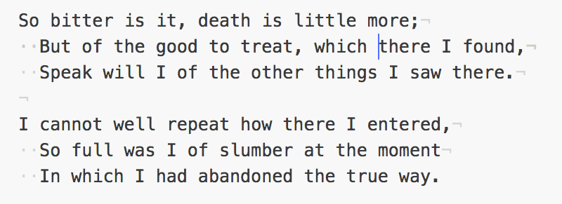

# cursory-glance README

Atom package that highlights the cursors when there are more than of them. (Using VSCode? See the [VSCode extension](https://marketplace.visualstudio.com/items?itemName=tuomassalo.cursory-glance).)

## Features

I found myself forgetting the multi-cursor feature on, and editing multiple places by accident. So I wrote this package that annotates the cursor with the number of cursors. The extension is activated when the user creates multiple selections with e.g. `cmd-d`.

## Extension Settings

No settings for now.

## Known Issues

- If there are more than nine cursors, only `*` is shown in the badge. That's just laziness.

## Release Notes

### 0.1.0

Initial release.
